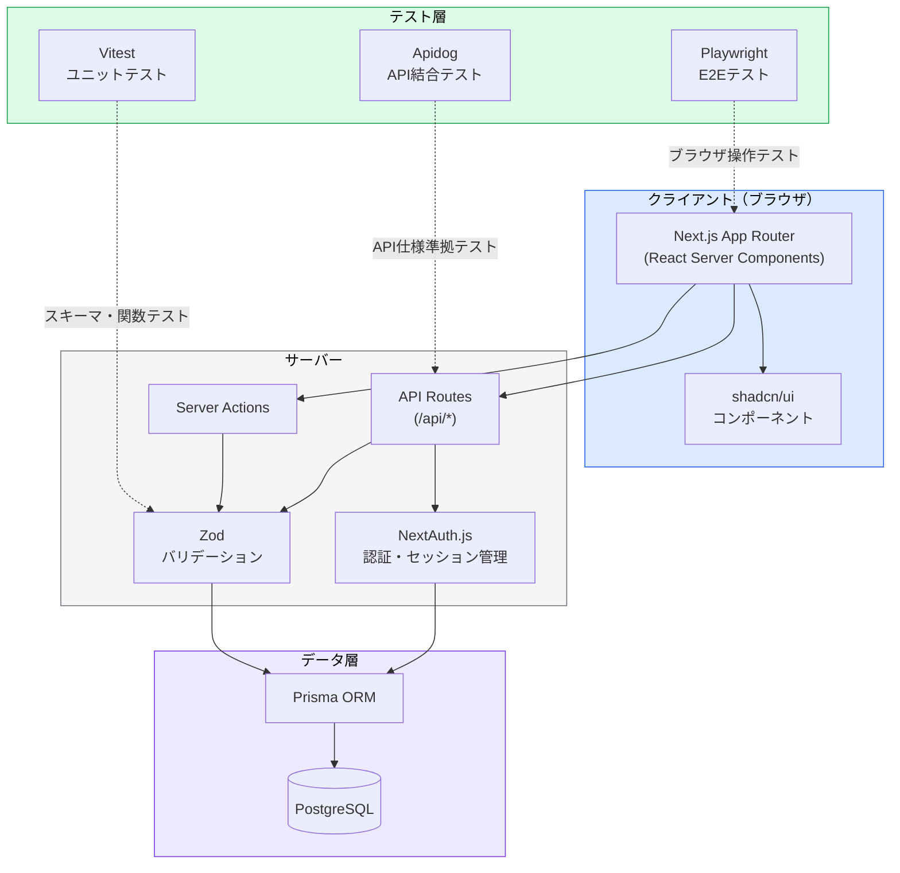
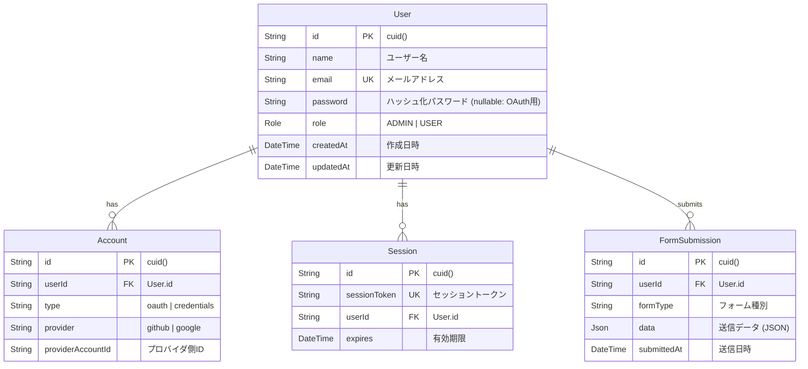
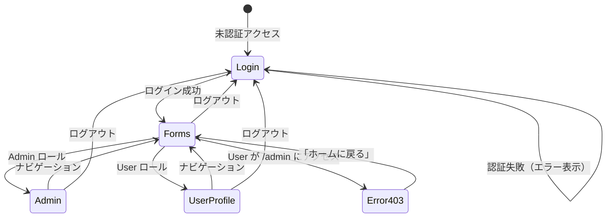

# 基本設計書 (BASIC_DESIGN.md)

## 1. システム概要

AI自動テストのベストプラクティスを実証するためのテストベッドアプリケーション。  
認証・フォーム入力・権限管理という3つの検証領域を通じて、Vitest（ユニット）/ Playwright（E2E）/ Apidog（API）の自動テスト手法を学習・検証する。

---

## 2. システム構成図



---

## 3. ER図



### ロール定義

| ロール | 値 | 権限 |
|---|---|---|
| 管理者 | `ADMIN` | 全画面アクセス可。ユーザー一覧の閲覧 |
| 一般ユーザー | `USER` | `/user` のみアクセス可。`/admin` は403 |

---

## 4. 画面遷移図



### 画面一覧

| # | 画面名 | パス | アクセス権 | 概要 |
|---|---|---|---|---|
| 1 | ログイン | `/login` | 全員 | メール/パスワード + OAuthログイン |
| 2 | 検証用フォーム | `/forms` | 認証済み | shadcn/ui各種フォーム要素の検証 |
| 3 | 管理者ダッシュボード | `/admin` | Admin | KPIカード + ユーザー一覧テーブル |
| 4 | ユーザープロファイル | `/user` | User | プロファイル表示 |
| 5 | 403エラー | `/403` | - | アクセス権限エラー |

---

## 5. API設計

### 5.1 認証エンドポイント（NextAuth.js 管理）

| メソッド | パス | 説明 |
|---|---|---|
| GET/POST | `/api/auth/[...nextauth]` | NextAuth.js ルートハンドラ |
| GET | `/api/auth/session` | 現在のセッション情報取得 |

### 5.2 アプリケーションエンドポイント

| メソッド | パス | 権限 | 説明 | リクエスト | レスポンス |
|---|---|---|---|---|---|
| POST | `/api/validate/text` | 認証済み | テキスト入力バリデーション | `{ name, email, age }` | `{ success, errors? }` |
| POST | `/api/validate/select` | 認証済み | セレクト入力バリデーション | `{ category, details? }` | `{ success, errors? }` |
| POST | `/api/validate/date` | 認証済み | 日付入力バリデーション | `{ date }` | `{ success, errors? }` |
| POST | `/api/validate/checkbox` | 認証済み | チェック/スイッチ入力バリデーション | `{ items[], toggle }` | `{ success, errors? }` |
| POST | `/api/validate/conditional` | 認証済み | 条件付きバリデーション | `{ category, details? }` | `{ success, errors? }` |
| GET | `/api/admin/users` | Admin | ユーザー一覧取得 | - | `{ users[] }` |
| GET | `/api/admin/stats` | Admin | KPI統計取得 | - | `{ totalUsers, activeSessions, ... }` |

### 5.3 エラーレスポンス標準フォーマット

```json
{
  "success": false,
  "errors": [
    { "field": "email", "message": "メールアドレスの形式が正しくありません" },
    { "field": "age", "message": "年齢は0以上の数値を入力してください" }
  ]
}
```

---

## 6. 非機能要件

| 項目 | 要件 |
|---|---|
| レスポンスタイム | API レスポンス 500ms 以内 |
| セキュリティ | パスワードは bcrypt ハッシュ化。CSRF対策はNextAuth.js内蔵機能を利用 |
| 認証 | JWT セッション（NextAuth.js デフォルト） |
| 環境変数管理 | `.env.local` で管理。AIエージェントによる読み取り・出力は禁止 |
| ブラウザ対応 | Chrome / Firefox / Safari 最新版 |
| アクセシビリティ | shadcn/ui のデフォルトa11y対応を維持 |
