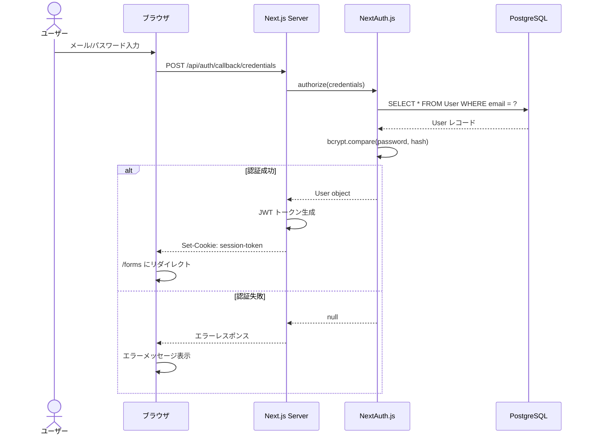
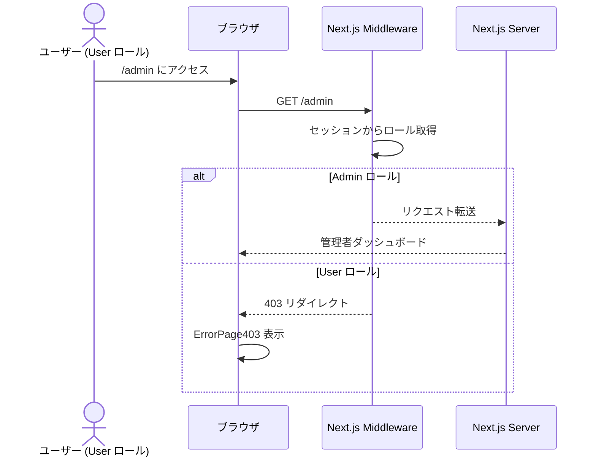

# 詳細設計書 (DETAIL_DESIGN.md)

## 1. コンポーネント設計

### 1.1 コンポーネントツリー

```mermaid
graph TD
    RootLayout["RootLayout\n(app/layout.tsx)"]
    
    subgraph Auth["認証"]
        LoginPage["LoginPage\n(/login)"]
        LoginForm["LoginForm"]
        OAuthButtons["OAuthButtons"]
    end

    subgraph Forms["フォーム検証"]
        FormsPage["FormsPage\n(/forms)"]
        FormsSidebar["FormsSidebar"]
        TextInputCard["TextInputCard"]
        SelectCard["SelectCard"]
        DatePickerCard["DatePickerCard"]
        CheckboxCard["CheckboxCard"]
        ConditionalCard["ConditionalCard"]
    end

    subgraph Admin["管理者"]
        AdminPage["AdminPage\n(/admin)"]
        KPICards["KPICards"]
        UsersTable["UsersTable"]
    end

    subgraph User["一般ユーザー"]
        UserPage["UserPage\n(/user)"]
        ProfileCard["ProfileCard"]
    end

    subgraph Shared["共有コンポーネント"]
        Header["Header"]
        RoleBadge["RoleBadge"]
        ThemeToggle["ThemeToggle"]
        ErrorPage403["ErrorPage403"]
    end

    RootLayout --> Header
    RootLayout --> LoginPage
    RootLayout --> FormsPage
    RootLayout --> AdminPage
    RootLayout --> UserPage

    LoginPage --> LoginForm
    LoginPage --> OAuthButtons

    FormsPage --> FormsSidebar
    FormsPage --> TextInputCard
    FormsPage --> SelectCard
    FormsPage --> DatePickerCard
    FormsPage --> CheckboxCard
    FormsPage --> ConditionalCard

    AdminPage --> KPICards
    AdminPage --> UsersTable

    UserPage --> ProfileCard

    Header --> RoleBadge
    Header --> ThemeToggle

    style Auth fill:#dbeafe,stroke:#2563eb,color:#000
    style Forms fill:#dcfce7,stroke:#16a34a,color:#000
    style Admin fill:#ede9fe,stroke:#7c3aed,color:#000
    style User fill:#ffedd5,stroke:#ea580c,color:#000
    style Shared fill:#f5f5f5,stroke:#6c757d,color:#000
```



### 1.2 コンポーネント一覧

| コンポーネント | パス | 責務 | 使用する shadcn/ui |
|---|---|---|---|
| `LoginForm` | `src/components/auth/login-form.tsx` | メール/パスワードログインフォーム | Input, Button, Form, Label |
| `OAuthButtons` | `src/components/auth/oauth-buttons.tsx` | GitHub/Google OAuthボタン | Button |
| `FormsSidebar` | `src/components/forms/forms-sidebar.tsx` | フォーム画面のサイドバーナビ | NavigationMenu |
| `TextInputCard` | `src/components/forms/text-input-card.tsx` | テキスト入力検証カード | Card, Input, Form, Label |
| `SelectCard` | `src/components/forms/select-card.tsx` | セレクト/コンボボックス検証カード | Card, Select, Combobox |
| `DatePickerCard` | `src/components/forms/date-picker-card.tsx` | 日付選択検証カード | Card, DatePicker, Popover, Calendar |
| `CheckboxCard` | `src/components/forms/checkbox-card.tsx` | チェック/スイッチ検証カード | Card, Checkbox, Switch, RadioGroup |
| `ConditionalCard` | `src/components/forms/conditional-card.tsx` | 条件付きバリデーション検証カード | Card, Select, Textarea, Form |
| `KPICards` | `src/components/admin/kpi-cards.tsx` | ダッシュボードKPI表示 | Card |
| `UsersTable` | `src/components/admin/users-table.tsx` | ユーザー一覧テーブル | Table |
| `ProfileCard` | `src/components/user/profile-card.tsx` | ユーザープロファイル表示 | Card, Avatar |
| `Header` | `src/components/layout/header.tsx` | 共通ヘッダー | NavigationMenu, Button |
| `RoleBadge` | `src/components/layout/role-badge.tsx` | ロール表示バッジ | Badge |
| `ThemeToggle` | `src/components/layout/theme-toggle.tsx` | ダークモード切替 | Button, DropdownMenu |
| `ErrorPage403` | `src/components/error/error-403.tsx` | 403エラー画面 | Card, Button |

---

## 2. Zodスキーマ設計

各フォームのバリデーションスキーマを Zod で定義する。

### 2.1 スキーマファイル構成

```
src/lib/schemas/
├── auth.ts           # 認証スキーマ
├── text-input.ts     # テキスト入力スキーマ
├── select-input.ts   # セレクト入力スキーマ
├── date-input.ts     # 日付入力スキーマ
├── checkbox-input.ts # チェック/スイッチスキーマ
└── conditional.ts    # 条件付きバリデーションスキーマ
```

### 2.2 スキーマ定義（疑似コード）

```typescript
// auth.ts
export const loginSchema = z.object({
  email: z.string().email("メールアドレスの形式が正しくありません"),
  password: z.string().min(8, "パスワードは8文字以上で入力してください"),
});

// text-input.ts
export const textInputSchema = z.object({
  name: z.string().min(1, "名前は必須です").max(50, "名前は50文字以内で入力してください"),
  email: z.string().email("メールアドレスの形式が正しくありません"),
  age: z.coerce.number().int().min(0, "年齢は0以上の数値を入力してください").max(150, "年齢は150以下で入力してください"),
});

// conditional.ts
export const conditionalSchema = z.object({
  category: z.enum(["categoryA", "categoryB", "other"]),
  details: z.string().optional(),
}).refine(
  (data) => data.category !== "other" || (data.details && data.details.length > 0),
  { message: "「その他」を選択した場合、詳細説明は必須です", path: ["details"] }
);
```

---

## 3. 認証・認可フロー

### 3.1 ログインシーケンス



### 3.2 権限チェックシーケンス



---

## 4. ディレクトリ構成（実装予定）

```
src/
├── app/                            # Next.js App Router
│   ├── layout.tsx                  # ルートレイアウト
│   ├── page.tsx                    # ホーム（/forms にリダイレクト）
│   ├── login/
│   │   └── page.tsx                # ログイン画面
│   ├── forms/
│   │   └── page.tsx                # 検証用フォーム画面
│   ├── admin/
│   │   └── page.tsx                # 管理者ダッシュボード
│   ├── user/
│   │   └── page.tsx                # ユーザープロファイル
│   ├── 403/
│   │   └── page.tsx                # 403エラー画面
│   └── api/
│       ├── auth/[...nextauth]/
│       │   └── route.ts            # NextAuth ルートハンドラ
│       ├── validate/
│       │   ├── text/route.ts
│       │   ├── select/route.ts
│       │   ├── date/route.ts
│       │   ├── checkbox/route.ts
│       │   └── conditional/route.ts
│       └── admin/
│           ├── users/route.ts
│           └── stats/route.ts
├── components/                     # UIコンポーネント
│   ├── auth/
│   ├── forms/
│   ├── admin/
│   ├── user/
│   ├── layout/
│   ├── error/
│   └── ui/                        # shadcn/ui コンポーネント
├── lib/
│   ├── schemas/                   # Zodスキーマ
│   ├── auth.ts                    # NextAuth 設定
│   ├── prisma.ts                  # Prisma クライアント
│   └── utils.ts                   # ユーティリティ
├── middleware.ts                   # 認証・権限チェック
└── types/
    └── index.ts                   # 型定義
tests/
└── e2e/
    ├── auth.spec.ts               # 認証E2Eテスト
    ├── forms.spec.ts              # フォームE2Eテスト
    └── rbac.spec.ts               # ロールベースアクセス制御E2Eテスト
prisma/
├── schema.prisma                  # Prismaスキーマ
└── seed.ts                        # シードデータ
```

---

## 5. テスト設計マトリクス

### 5.1 ユニットテスト（Vitest）

| テスト対象 | ファイル | テスト観点 |
|---|---|---|
| `loginSchema` | `src/lib/schemas/auth.test.ts` | 有効/無効なメール、パスワード長、空文字、null |
| `textInputSchema` | `src/lib/schemas/text-input.test.ts` | 名前の最大長、メール形式、年齢の境界値 |
| `conditionalSchema` | `src/lib/schemas/conditional.test.ts` | 「その他」選択時の必須チェック、他選択時の任意チェック |
| `selectInputSchema` | `src/lib/schemas/select-input.test.ts` | enum外の値、null |
| `dateInputSchema` | `src/lib/schemas/date-input.test.ts` | 有効/無効な日付、過去日・未来日 |
| `checkboxInputSchema` | `src/lib/schemas/checkbox-input.test.ts` | 空配列、最小選択数 |

### 5.2 E2Eテスト（Playwright）

| テストシナリオ | ファイル | BDD対応 |
|---|---|---|
| ログイン成功/失敗 | `tests/e2e/auth.spec.ts` | SPEC.md 3.1 |
| Admin/Userルーティング制御 | `tests/e2e/rbac.spec.ts` | SPEC.md 3.1 |
| 各フォーム入力・バリデーション | `tests/e2e/forms.spec.ts` | SPEC.md 3.2 |
| 条件付きバリデーション | `tests/e2e/forms.spec.ts` | SPEC.md 3.3 |
| エラー状態のUI表示 | `tests/e2e/forms.spec.ts` | SPEC.md 4.3 |
